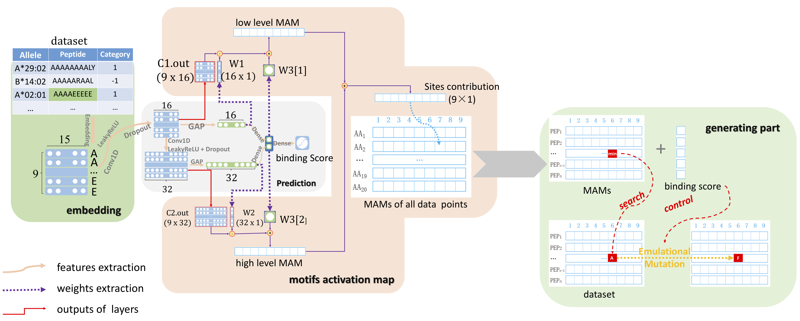

# MAM (Motif Activation Mapping)

MAM is an in silico approach for predicting the MHC-I-peptide binding affinity, 
extracting binding motifs, and generating novel peptides with high affinity.

For more details, please refer to the manuscript "In silico design of MHC class I 
high binding affinity peptides through motifs activation map". 
You can access the full paper [here](https://bmcbioinformatics.biomedcentral.com/articles/10.1186/s12859-018-2517-3).

## Installation
You can clone the repository using Git by running the following command:
```angular2html
git clone https://github.com/deepomicslab/MAM.git
```
Alternatively, you can download the source code directly from the repository:
```angular2html
wget https://github.com/deepomicslab/MAM/archive/main.tar.gz
tar -xzvf main.tar.gz
```

## Dependencies
Make sure you have the following dependencies installed on your system:
* Python &ge;3.6 
* Numpy 1.23.0 
* Pandas 1.3.4
* Scipy 1.10.1 
* Sklearn 1.0.1
* Tensorflow 2.7.0
* Keras 2.7.0
* Gensim 4.0.1

## Get started
1. **Embed amino acids to vector**
   1. Configure the `config.ini` file and set `Vec == True`, while the rest should be set to `False`
   2. Run
   ```angular2html 
   python main.py config.ini
   ```
2. **Train MAM-CNN predictor**
   1. Configure the `config.ini` file and set `train == True` and the rest to `False`
   2. Run python main.py config.ini
3. **Evaluate the trained MAM-CNN model** 
   1. Configure the `config.ini` file and set `evaluate == True` and the rest to `False`
   2. Run python main.py config.ini
4. **Generate new peptides with potential high affinity**
   1. Configure the `config.ini` file and set `inference == True` and the rest to `False`
   2. Run python main.py config.ini
5. **Apply MAM with fine-tuning**
   1. Configure the `config.ini` file and set `fine_train == True`, `fine_evaluate  == True`, `fine_inference == True`, and the rest to `False`
   2. Run python main.py config.ini

For your convenience, example training and testing datasets for MAM are provided within the `./MAM/train_test_data` directory.
